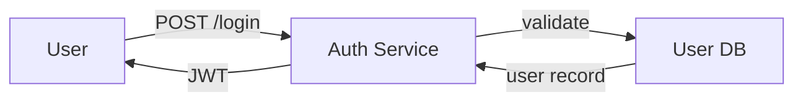

# Mermaid

Generate a Mermaid diagram. Can work from code, a description, or the output of another command like `/trace-flow`.

## Usage

```
/mermaid [source-or-description]
```

Examples:
- `/mermaid src/api/` — diagram the module structure
- `/mermaid "auth flow"` — diagram based on a description or by tracing the code
- `/mermaid` — diagram whatever was just discussed in conversation

$ARGUMENTS

## Step 1: Determine What to Diagram

Based on the input, figure out what kind of diagram fits:

| Situation | Diagram Type |
|-----------|-------------|
| Data/request flow through services | `flowchart` or `sequenceDiagram` |
| State transitions | `stateDiagram-v2` |
| Component/module relationships | `flowchart` |
| Timeline or process steps | `flowchart LR` |
| Class/type relationships | `classDiagram` |
| Database schema | `erDiagram` |
| Git branching strategy | `gitGraph` |

If the source is code, read it and understand the relationships before choosing a diagram type. Don't just list files — capture how things connect.

## Step 2: Build the Diagram

Read the code or parse the description. Identify:

- **Nodes** — the key entities, services, components, or steps
- **Edges** — how they connect, what flows between them
- **Groups** — logical clusters or boundaries (subgraphs)
- **Labels** — what travels along each edge (data types, events, HTTP methods)

## Step 3: Output

Output the diagram in a fenced code block:

````markdown

````

## Guidelines

- **Simplify aggressively.** A diagram with 30 nodes is unreadable. Collapse detail into subgraphs or omit low-signal nodes. Aim for 5-15 nodes.
- **Label the edges.** Unlabeled arrows are ambiguous. What's flowing — an HTTP request? A function call? An event? A data object?
- **Use subgraphs for boundaries.** Client vs server, service vs service, sync vs async — these are the most useful groupings.
- **Match the question.** If someone asks "how does auth work?", diagram the auth flow. Don't diagram the entire system with auth highlighted.
- **Prefer left-to-right for flows.** `flowchart LR` reads more naturally for request/data flows. Use `TD` (top-down) for hierarchies.
- **Use sequence diagrams for multi-actor interactions.** If the flow involves back-and-forth between services (request, response, callback), a sequence diagram is clearer than a flowchart.
- **Test it mentally.** Read the diagram and ask: "Does this actually help someone understand the thing?" If not, restructure.
